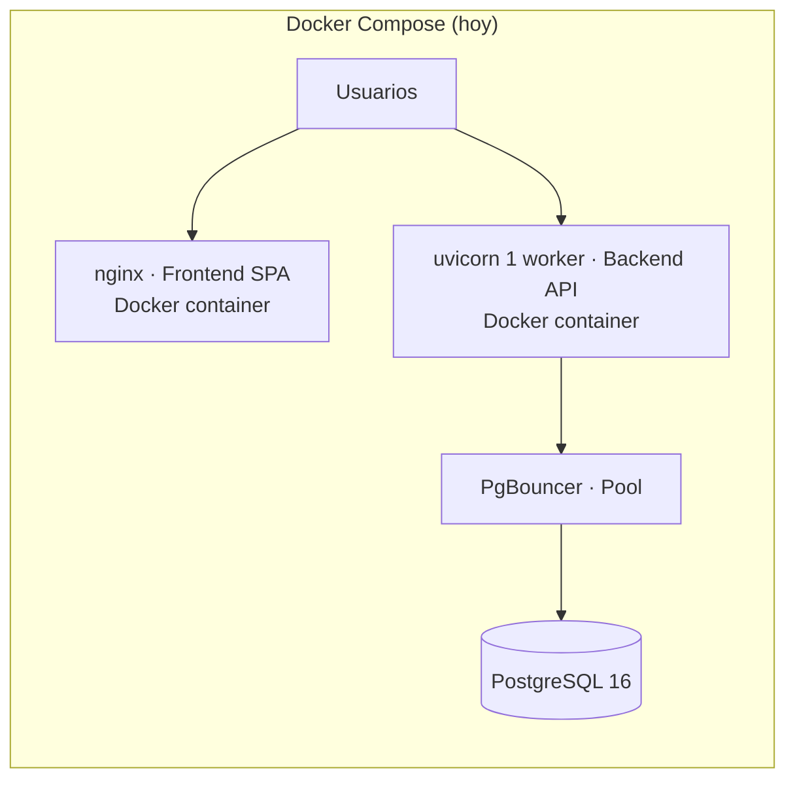
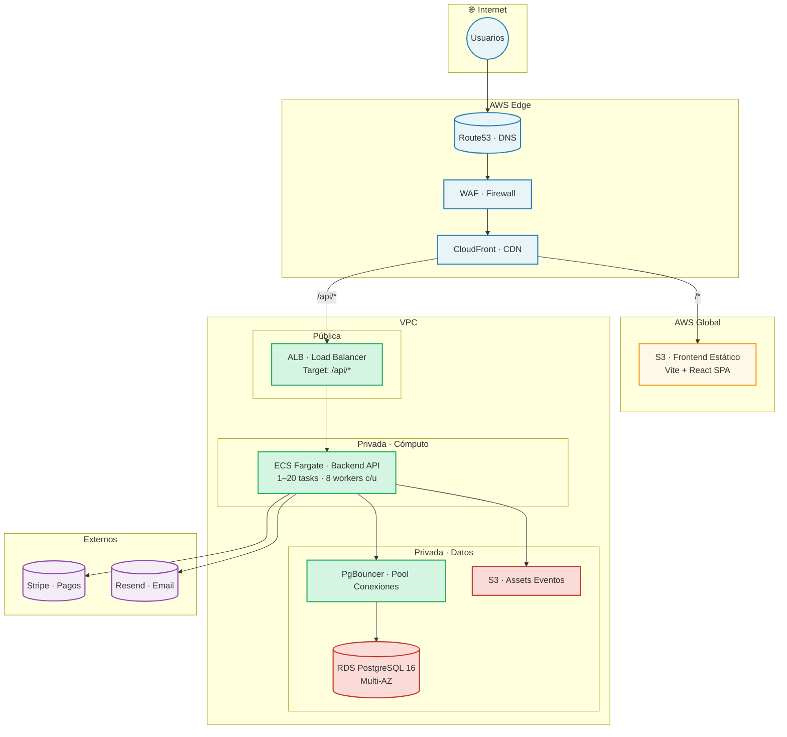
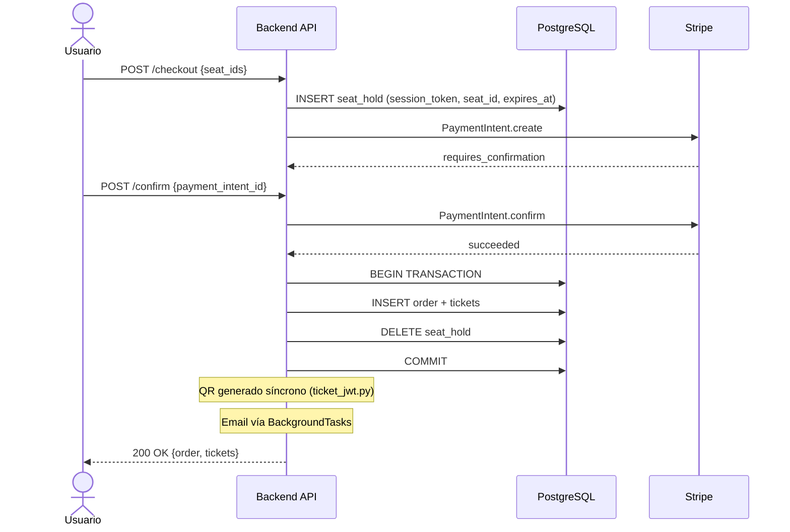

# Ticket Yourself — Arquitectura AWS

> Target: 1–20 tasks ECS · Multi-AZ · Alta concurrencia en flash sales

## Estado actual (hoy)

Hoy la app corre en Docker Compose. El código ya soporta varios patrones de escalabilidad aunque la infraestructura cloud aún no existe.

### Lo que ya está listo en código

| Componente | Código | Estado |
|------------|--------|--------|
| **API async** | FastAPI + asyncpg + SQLAlchemy async | ✅ Listo. Pool nativo maneja centenares de conexiones |
| **PgBouncer compat** | `database.py` detecta `PGBOUNCER=true`, desactiva statement cache | ✅ Listo. Ya corre en dev compose |
| **Seat holds** | `orm_models.SeatHold` + `services/seats.py` (create/release/consume/assign) | ✅ Listo. Cleanup periódico pendiente |
| **JWT stateless** | `security.py` — HS256, Bearer token | ✅ Listo. Escala horizontal sin cambios |
| **Health check** | `GET /api/health` | ✅ Listo. Para ALB target group |
| **Stripe webhooks** | Flujo completo de confirmación de pago síncrono | ✅ Listo. |
| **Email async** | `BackgroundTasks` + `asyncio.create_task` vía Resend | ⚠️ Fire-and-forget. Sin cola persistente. Suficiente hoy |
| **8 workers** | `Dockerfile` CMD sin `--workers` | ❌ Pendiente. Hoy corre 1 worker |
| **Cleanup seat holds** | No existe | ❌ Pendiente. `DELETE WHERE expires_at < NOW()` |

### Target AWS

## Especificaciones target

| Capa | Servicio | Detalle |
|------|----------|---------|
| Edge | Route53 → WAF → CloudFront | 250K RPS / 150 Gbps base. `/*` → S3, `/api/*` → ALB |
| Frontend | S3 | Build estático Vite + React. CloudFront al frente, S3 nunca recibe tráfico directo |
| Cómputo | ECS Fargate | 1–20 tasks. 8 workers uvicorn + PgBouncer sidecar por task |
| Base de datos | RDS PostgreSQL 16 | ~500 conexiones vía PgBouncer. Seat holds con tabla + cleanup periódico |
| Assets | S3 | Posters, banners, galerías |
| Pagos | Stripe | API + webhooks |
| Email | Resend | Confirmaciones, recuperación. `BackgroundTasks` hoy |

## Flujo de pago

## Decisiones

| Excluido | Por qué |
|----------|---------|
| **Kubernetes** | 20 tasks no lo justifican. Se evalúa > 50 tasks |
| **Multi-región** | CloudFront en el edge alcanza. Una región basta |
| **Microservicios** | Monolito FastAPI alcanza. Se divide > 5 devs |
| **RDS Proxy** | PgBouncer sidecar cumple la misma función y ya está en docker-compose.yml |
| **Kafka** | Overkill. SQS si se necesita cola durable, pero hoy el flujo síncrono + BackgroundTasks funciona |
| **SQS** | No implementado. Emisión síncrona (INSERT + QR + email en el mismo request). SQS agrega complejidad sin beneficio demostrado. Se agrega si hay pérdida de emails o backpressure |
| **Lambda** | FastAPI mantiene pool stateful (PgBouncer, asyncpg). Refactor innecesario |
| **Redis / Valkey / Dragonfly** | PG cubre seat holds y rate limiting. `functools.lru_cache` para data cuasi-estática. Cero infraestructura extra |
| **Auto-scaling** | 1 task fijo hoy. Escalar manual a 2-3 antes de alarmas |
| **Multi-AZ RDS** | Single-AZ hoy. Multi-AZ cuando haya datos que justifiquen el doble de costo |
| **CloudFront** | Hoy sirve nginx Docker. Migrar a S3 + CF cuando haya tráfico global |
| **CDK / IaC** | Se escribe cuando se despliegue. Hoy no hay infra que versionar |

## Código reutilizable en AWS

| Artefacto | Uso en AWS | Cambios necesarios |
|-----------|------------|-------------------|
| `backend/Dockerfile` | Imagen ECS | `--workers 8` sin `--reload` |
| `frontend/Dockerfile` | Build multi-stage → deploy a S3 | Script de deploy a S3 |
| `docker-compose.yml` | Config PgBouncer como sidecar | Ninguno |
| `backend/database.py` | SQLAlchemy async + asyncpg → RDS | Ninguno, ya soporta PgBouncer |
| `backend/security.py` | JWT HS256 — auth stateless | Ninguno, escala horizontal |
| `backend/services/seats.py` | Seat holds en RDS | Agregar cleanup periódico (`DELETE WHERE expires_at < NOW()`) |
