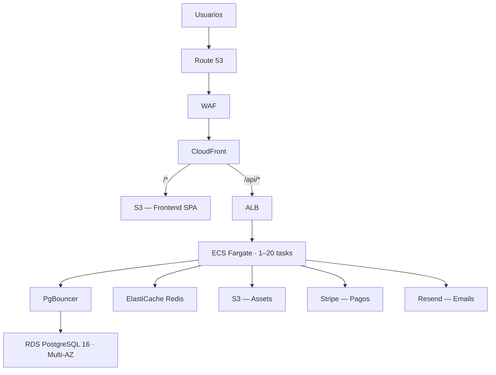
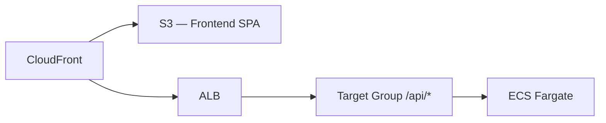
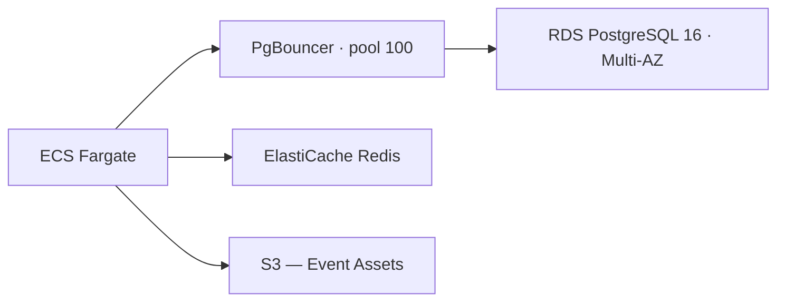
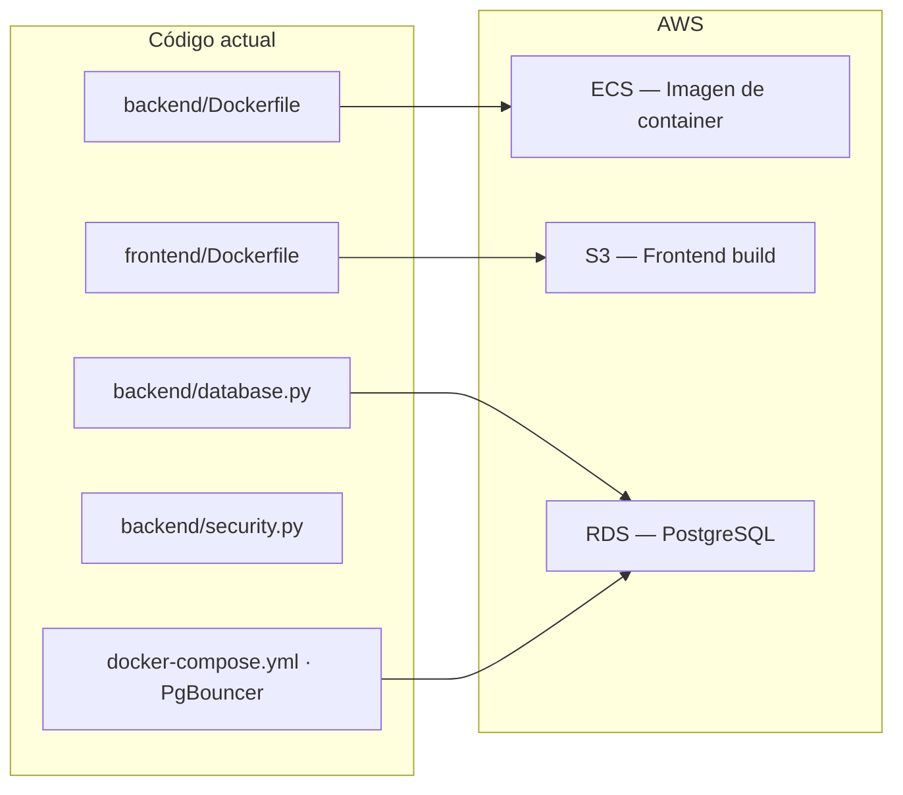
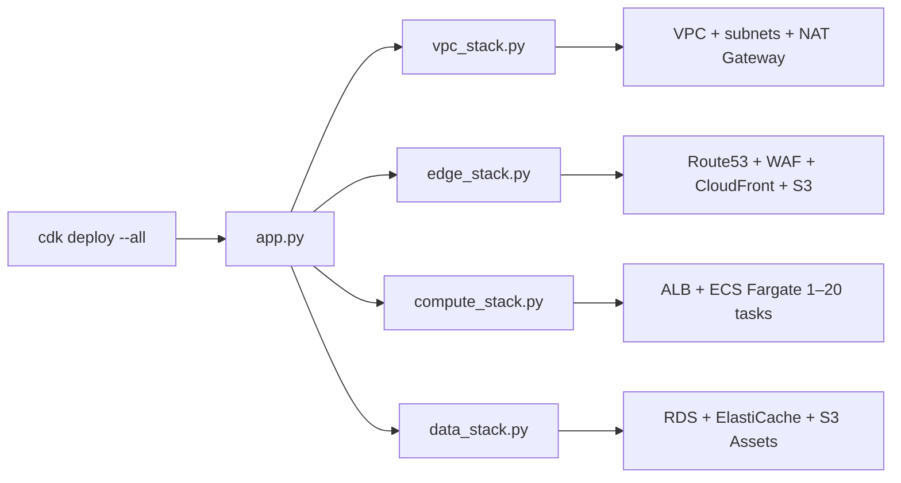

# Ticket Yourself — Arquitectura AWS

> Auto-scaling: 1–20 tasks · Multi-AZ · Alta concurrencia en flash sales

## Diagrama de flujo



## Capas

### 1. Edge

| Servicio | Función |
|----------|---------|
| Route 53 | Resolución DNS hacia CloudFront |
| WAF | Rate limiting anti-bot, reglas OWASP |
| CloudFront | CDN, terminación SSL, ruteo `/*` → S3 y `/api/*` → ALB |

### 2. Frontend



| Componente | Rol |
|------------|-----|
| **S3** | Bucket público con build estático (Vite + React) |
| **ALB** | Application Load Balancer, target group `/api/*` con health checks |

### 3. Aplicación

| Parámetro | Valor |
|-----------|-------|
| **ECS Fargate** | 1–20 tasks, auto-scaling por RequestCountPerTarget (target: 1000) |
| **Por task** | 8 workers uvicorn, FastAPI async, PgBouncer sidecar (pool 100) |
| **Imagen** | `backend/Dockerfile` existente — sin modificaciones |
| **Auto-scaling** | RequestCountPerTarget — métrica recomendada para tráfico tipo flash sale por AWS (responde más rápido que CPU). Desde junio 2026, ECS soporta resolución de 20s, reduciendo el tiempo de scale-out de 363s a 86s (76% más rápido). Contracción automática al descender la carga |
| **Fargate Spot** | Opcional: usar FARGATE_SPOT como capacity provider para tasks no críticos (hasta 70% de ahorro). Sin fallback automático — evaluar si aplica |

### 3a. Costo de Fargate

| Capacidad | vCPU | Memoria | Precio por hora | 24/7 por task/mes |
|-----------|------|---------|-----------------|-------------------|
| 1 task mínimo | 1 vCPU | 2 GB | $0.049 | ~$36 |
| 20 tasks pico | 20 vCPU | 40 GB | $0.98 | ~$720 (solo durante horas pico) |

Costo real depende del tiempo en baja vs alta carga. En la práctica, con 2 tasks promedio + escalados esporádicos a 8–10 tasks, el estimado es ~$250–400/mes.

### 4. Datos



| Servicio | Propósito |
|----------|-----------|
| **RDS PostgreSQL 16** | Base de datos principal. Multi-AZ para tolerancia a fallos de zona. ~500 conexiones concurrentes |
| **PgBouncer** | Pool de conexiones transaccional. Multiplexa conexiones de todos los tasks hacia RDS |
| **ElastiCache Redis** | Seat holds distribuidos (reserva temporal de asientos durante compra), rate limiting, session cache |
| **S3** | Almacenamiento de assets de eventos: posters, banners, galería de imágenes |

### 5. Servicios externos

| Servicio | Uso |
|----------|-----|
| **Stripe** | Procesamiento de pagos vía API + webhooks |
| **Resend** | Envío de emails transaccionales (confirmación de compra, recuperación de contraseña) |

## Decisiones de arquitectura

| Excluido | Justificación |
|----------|---------------|
| **Kubernetes** | ECS Fargate es suficiente para un máximo de 20 tasks. Kubernetes se considera cuando la escala supera los 50 tasks o se requiere multi-región |
| **Multi-región** | CloudFront proporciona caché en el edge. Una sola región (us-east-1) es adecuada para ~1000 usuarios concurrentes |
| **Microservicios** | El monolito FastAPI async maneja hasta ~1600 conexiones simultáneas por task. Se divide cuando el equipo supere 5 desarrolladores |
| **RDS Proxy** | PgBouncer como sidecar cumple la misma función y ya está configurado en el código existente (`docker-compose.yml`). RDS Proxy agrega costo sin beneficio adicional |
| **SQS / Celery** | La emisión de tickets post-pago es sincrónica. Se migrará a async si la contención en escritura lo requiere |
| **Lambda** | FastAPI mantiene pool de conexiones stateful (PgBouncer, database pool). Migrar a Lambda requeriría refactor significativo sin beneficio para este perfil de tráfico |
| **Tabla de costos** | Se calculará al momento de solicitar presupuesto. Estimar costos sin métricas de uso real es especulativo |

## Código existente reutilizado



| Artefacto | Uso en AWS |
|-----------|------------|
| `backend/Dockerfile` | Construcción de la imagen Docker para ECS |
| `frontend/Dockerfile` | Build multi-stage (Node → nginx) → deploy a S3 |
| `docker-compose.yml` | Configuración de PgBouncer reutilizada como sidecar en cada task |
| `backend/database.py` | SQLAlchemy async + asyncpg — conexión a RDS |
| `backend/security.py` | JWT HS256 — autenticación stateless, escala horizontalmente sin cambios |

## Infraestructura como Código (CDK Python)

Se utiliza **AWS CDK en Python** por consistencia con el stack del backend.

| CDK | Alternativa (Terraform) |
|-----|------------------------|
| Python nativo — mismo lenguaje que el backend | HCL + opcionalmente CDKTF (dos lenguajes) |
| Constructos oficiales para ECS, RDS, ALB, CloudFront | Módulos de comunidad con versionado variable |
| `cdk deploy` — CloudFormation nativo con rollback automático | State en S3 + DynamoDB, ciclo `init/plan/apply` |
| Sin boilerplate de providers o workspaces | Configuración de providers, backends, workspaces |

### Estructura del stack

```
cdk/
├── app.py                  # Entry point
├── stack/
│   ├── vpc_stack.py        # VPC, NAT Gateway, subnets
│   ├── edge_stack.py       # Route53, WAF, CloudFront, S3 FE
│   ├── compute_stack.py    # ALB, ECS Fargate, auto-scaling
│   └── data_stack.py       # RDS, ElastiCache, S3 Assets
├── docker/
│   ├── backend.Dockerfile  # Referencia a backend/Dockerfile
│   └── frontend.Dockerfile # Referencia a frontend/Dockerfile
└── requirements.txt
```



El comando `cdk deploy --all` despliega la infraestructura completa. `cdk destroy` elimina todos los recursos. Sin estado externo, sin configuración manual.

## Referencias externas consultadas

| Fuente | Hallazgo | Impacto en la arquitectura |
|--------|----------|---------------------------|
| [AWS: ECS fast auto-scaling (jun 2026)](https://aws.amazon.com/about-aws/whats-new/2026/06/amazon-ecs-faster-autoscaling/) | Nueva resolución de 20s en métricas de auto-scaling. Scale-out bajó de 363s a 86s (76% más rápido) | La arquitectura ya usaba RequestCountPerTarget como métrica. El nuevo anuncio confirma que es la métrica correcta para burst traffic. Se actualizó la sección 3 con los tiempos concretos |
| [AWS re:Post — ECS burst scaling](https://repost.aws/questions/QUUhKobJ9_TBunO8cCCoI99g/ecs-fargate-auto-scaling-for-a-burst-traffic-case) | RequestCountPerTarget responde más rápido que CPU para picos de tráfico. Validado por AWS | Sin cambios — la métrica ya estaba correcta |
| [AWS Fargate Spot pricing](https://www.kubeblogs.com/ec2-or-fargate) | FARGATE_SPOT ofrece hasta 70% de descuento. Sin fallback automático | Se agregó nota en sección 3 como opcional. No se incluye por defecto por el riesgo de interrupción en flash sales |
| [Stack Overflow — PgBouncer sidecar](https://stackoverflow.com/questions/79072425/pgbouncer-sidecar-addressing-connection-pooling-and-load-balancing-issues) | Sidecar no centraliza pooling entre tasks, pero evita single point of failure. AWS recomienda sidecar sobre RDS Proxy | Sin cambios — el sidecar pattern ya estaba definido. Se confirma que es la práctica recomendada |
| [FastAPI Production Deployment Guide](https://craftyourstartup.com/cys-docs/cookbooks/fastapi-production-deployment) | Gunicorn + Uvicorn workers como entrypoint production-ready para FastAPI | Sin cambios — ya estábamos usando 8 workers uvicorn por task |
| [AWS: PgBouncer on RDS Multi-AZ](https://aws.amazon.com/blogs/database/fast-switchovers-with-pgbouncer-on-amazon-rds-multi-az-deployments-with-two-readable-standbys-for-postgresql/) | AWS provee parches para PgBouncer que reducen el downtime de switchover a ≤1s en RDS Multi-AZ | Sin cambios inmediatos. A considerar cuando se implementen las actualizaciones de base de datos |
