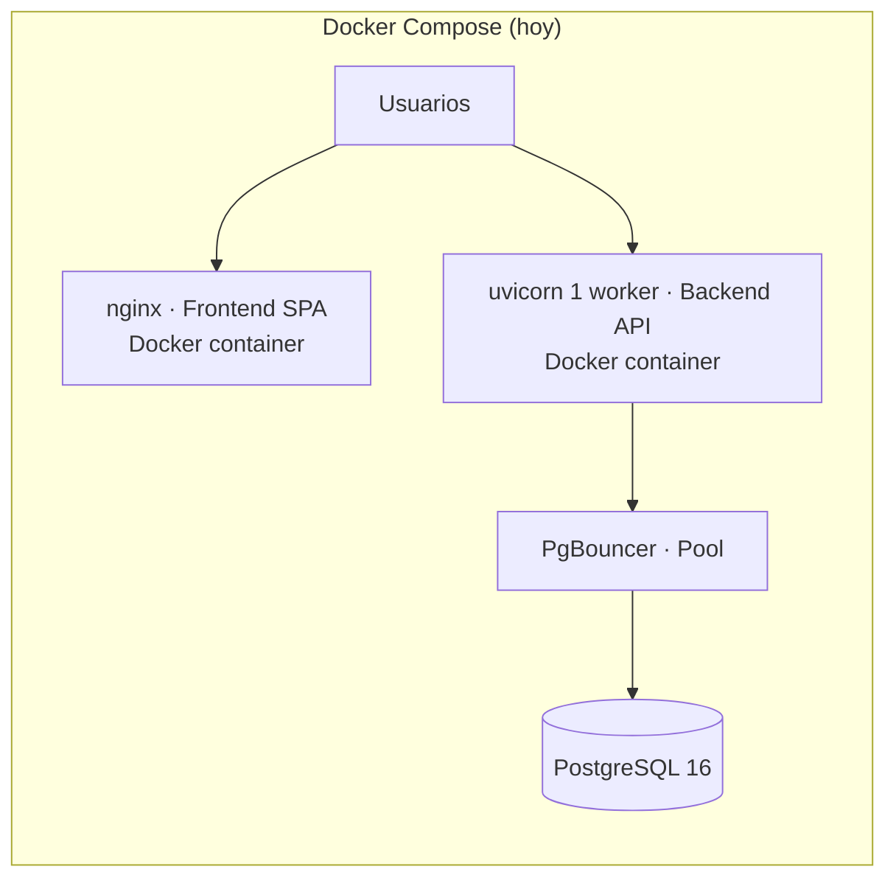
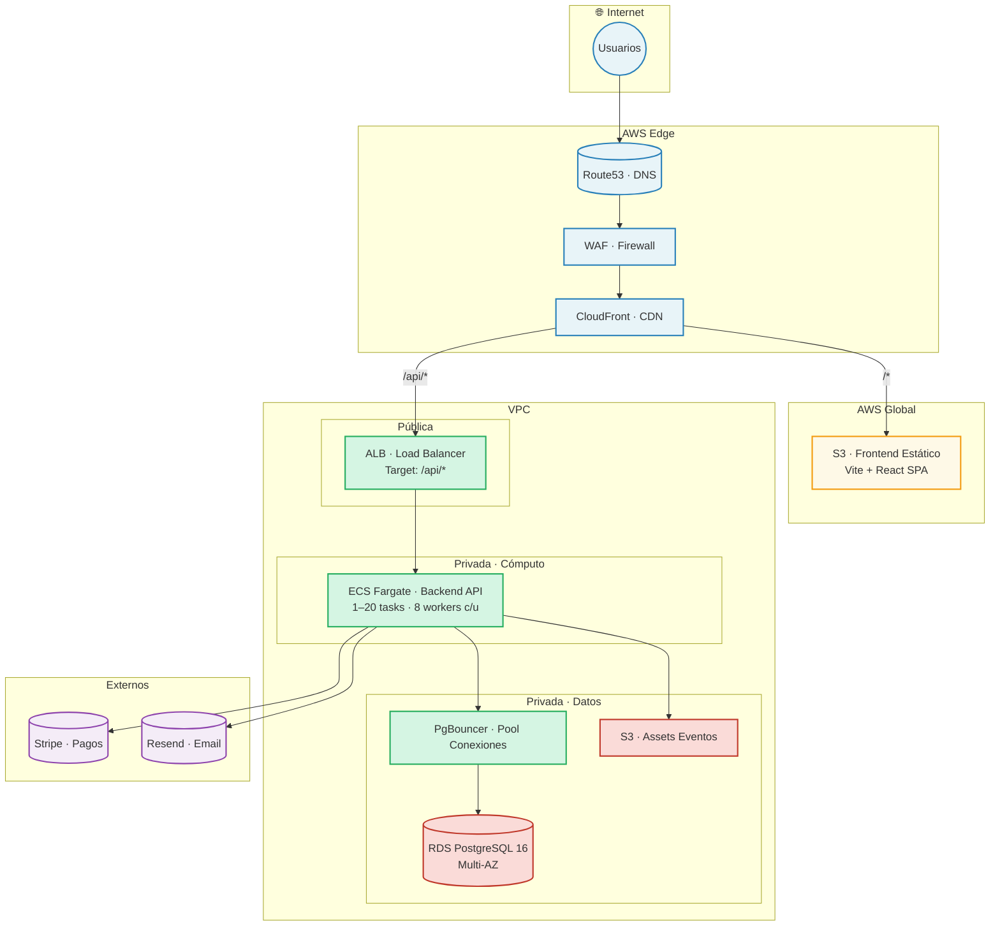
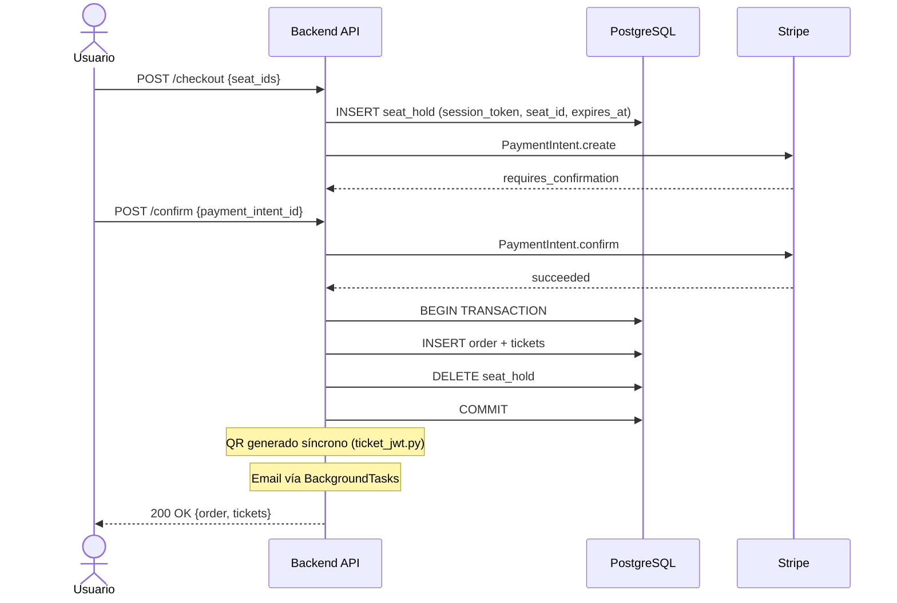

# Ticket Yourself — Arquitectura AWS

> Target: 1–20 tasks ECS · Multi-AZ · Alta concurrencia en flash sales

## Ambientes

| Aspecto | Staging (activo) | Production (futuro) |
|---------|------------------|---------------------|
| **Propósito** | Tests, QA, validación segura | Tráfico real de usuarios |
| **Infra** | 1 EC2 t4g.small + Docker Compose | VPC + ECS Fargate + RDS + S3/CloudFront |
| **CDK** | `cdk deploy TysStaging --context env=staging` | `cdk deploy TysProduction --context env=production` |
| **Costo** | ~$15/mes | ~$200–300/mes |
| **Stack** | `infra/cdk/tys_stack.py` | `infra/cdk/tys_stack.py` |

## Estado actual (hoy)

Hoy la app corre en Docker Compose. El código ya soporta varios patrones de escalabilidad. La infraestructura cloud se define con CDK Python en `infra/cdk/`.


```mermaid
flowchart LR
    subgraph "Docker Compose (hoy)"
        U["Usuarios"] --> FE["nginx · Frontend SPA<br/>Docker container"]
        U --> BE["uvicorn 1 worker · Backend API<br/>Docker container"]
        BE --> PGB["PgBouncer · Pool"]
        PGB --> PG[("PostgreSQL 16")]
    end
```

### Lo que ya está listo en código

| Componente | Código | Estado |
|------------|--------|--------|
| **API async** | FastAPI + asyncpg + SQLAlchemy async | ✅ Listo. Pool nativo maneja centenares de conexiones |
| **PgBouncer compat** | `database.py` detecta `PGBOUNCER=true`, desactiva statement cache | ✅ Listo. Ya corre en dev compose |
| **Seat holds** | `orm_models.SeatHold` + `services/seats.py` (create/release/consume/assign) | ✅ Listo. Cleanup periódico pendiente |
| **JWT stateless** | `security.py` — HS256, Bearer token | ✅ Listo. Escala horizontal sin cambios |
| **Stripe webhooks** | Flujo completo de confirmación de pago síncrono | ✅ Listo. |
| **Email async** | `BackgroundTasks` + `asyncio.create_task` vía Resend | ⚠️ Fire-and-forget. Sin cola persistente. Suficiente hoy |
| **CDK IaC (Python)** | `infra/cdk/tys_stack.py` — staging (EC2) + production (VPC/ECS/RDS/CF) | ✅ Listo. Despliegue con `cdk deploy --context env=` |
| **Health check** | `fargate.target_group.configure_health_check(path="/api/health")` | ✅ Listo. ALB target group verifica cada 30s |
| **HTTPS** | `certificate=` + `redirect_http=True` en el constructor de FargateService | ✅ Listo. Sin listener adicional |
| **Deployment circuit breaker** | `cfn_service.deployment_configuration` con rollback | ✅ Listo. Rollback automático en ECS |
| **ECR lifecycle** | `repo.add_lifecycle_rule(max_image_count=20)` | ✅ Listo. Sin acumulación de imágenes |
| **Log retention** | CloudWatch Logs con `THREE_MONTHS` | ✅ Listo. |
| **RDS backups** | `backup_retention=Duration.days(30)` + `multi_az=True` | ✅ Listo. |
| **Cleanup seat holds** | No existe | ❌ Pendiente. `DELETE WHERE expires_at < NOW()` |

### Target AWS


```mermaid
flowchart TB
    classDef edge fill:#e8f4f8,stroke:#2980b9,stroke-width:2px
    classDef frontend fill:#fef9e7,stroke:#f39c12,stroke-width:2px
    classDef compute fill:#d5f5e3,stroke:#27ae60,stroke-width:2px
    classDef external fill:#f4ecf7,stroke:#8e44ad,stroke-width:2px
    classDef db fill:#fadbd8,stroke:#c0392b,stroke-width:2px

    subgraph "🌐 Internet"
        U(("Usuarios"))
    end

    subgraph "AWS Edge"
        R53[("Route53 · DNS")] --> WAF["WAF · Firewall"] --> CF["CloudFront · CDN"]
    end

    subgraph "AWS Global"
        S3_FE["S3 · Frontend Estático<br/>Vite + React SPA"]
    end

    subgraph "VPC"
        subgraph "Pública"
            ALB["ALB · Load Balancer<br/>Target: /api/*"]
        end
        subgraph "Privada · Cómputo"
            ECS["ECS Fargate · Backend API<br/>1–20 tasks · 8 workers c/u"]
        end
        subgraph "Privada · Datos"
            PGB["PgBouncer · Pool Conexiones"]
            RDS[("RDS PostgreSQL 16<br/>Multi-AZ")]
            S3_A["S3 · Assets Eventos"]
        end
    end

    subgraph "Externos"
        STRIPE[("Stripe · Pagos")]
        RESEND[("Resend · Email")]
    end

    U --> R53
    CF -- "/*" --> S3_FE
    CF -- "/api/*" --> ALB
    ALB --> ECS
    ECS --> PGB --> RDS
    ECS --> S3_A
    ECS --> STRIPE
    ECS --> RESEND

    class U,R53,WAF,CF edge
    class S3_FE frontend
    class ALB compute
    class ECS,PGB compute
    class S3_A,RDS db
    class STRIPE,RESEND external
```

## Especificaciones target

| Capa | Servicio | Detalle |
|------|----------|---------|
| Edge | Route53 → WAF → CloudFront | 250K RPS / 150 Gbps base. `/*` → S3, `/api/*` → ALB |
| Frontend | S3 | Build estático Vite + React. CloudFront al frente, S3 nunca recibe tráfico directo |
| Cómputo | ECS Fargate | 1–20 tasks. 8 workers uvicorn + PgBouncer sidecar por task |
| Base de datos | RDS PostgreSQL 16 | ~500 conexiones vía PgBouncer. Seat holds con tabla + cleanup periódico |
| Assets | S3 | Posters, banners, galerías |
| Pagos | Stripe | API + webhooks |
| Email | Resend | Confirmaciones, recuperación. `BackgroundTasks` hoy |

## Flujo de pago


```mermaid
sequenceDiagram
    actor U as Usuario
    participant API as Backend API
    participant PG as PostgreSQL
    participant STRIPE as Stripe

    U->>API: POST /checkout {seat_ids}
    API->>PG: INSERT seat_hold (session_token, seat_id, expires_at)
    API->>STRIPE: PaymentIntent.create
    STRIPE-->>API: requires_confirmation
    U->>API: POST /confirm {payment_intent_id}
    API->>STRIPE: PaymentIntent.confirm
    STRIPE-->>API: succeeded
    API->>PG: BEGIN TRANSACTION
    API->>PG: INSERT order + tickets
    API->>PG: DELETE seat_hold
    API->>PG: COMMIT
    Note over API: QR generado síncrono (ticket_jwt.py)
    Note over API: Email vía BackgroundTasks
    API-->>U: 200 OK {order, tickets}
```

## Deploy

### Staging

```bash
# 1. Bootstrap CDK (una vez por cuenta/región)
cd infra/cdk
npx cdk bootstrap aws://<account>/us-east-1

# 2. Deploy
npx cdk deploy TysStaging --context env=staging

# 3. SSM secrets + levantar app
aws ssm start-session --target <instance-id>
sudo -u ec2-user vim /home/ec2-user/Ticketyourself/.env.prod
docker compose -f /home/ec2-user/Ticketyourself/docker-compose.prod.yml up -d
```

### Production

```bash
cd infra/cdk

# Build y push backend
docker build -t tys-backend:latest -f production/Dockerfile.aws ../backend
aws ecr get-login-password | docker login --username AWS --password-stdin <account>.dkr.ecr.us-east-1.amazonaws.com
docker tag tys-backend:latest <account>.dkr.ecr.us-east-1.amazonaws.com/tys-prod-backend:latest
docker push ...

# Frontend a S3
cd ../frontend && yarn install && yarn build
aws s3 sync dist/ s3://tys-prod-frontend/ --delete

# Deploy infra
cd ../infra/cdk
npx cdk deploy TysProduction --context env=production \
  --context domain=ticketyourself.com --context cert_arn=arn:aws:acm:...
```

## Código reutilizable en AWS

| Artefacto | Uso en AWS | Cambios necesarios |
|-----------|------------|-------------------|
| `frontend/Dockerfile` | Build multi-stage → deploy a S3 | Script de deploy a S3 |
| `docker-compose.yml` | Config PgBouncer como sidecar | Ninguno |
| `backend/database.py` | SQLAlchemy async + asyncpg → RDS | Ninguno, ya soporta PgBouncer |
| `backend/security.py` | JWT HS256 — auth stateless | Ninguno, escala horizontal |
| `backend/services/seats.py` | Seat holds en RDS | Agregar cleanup periódico (`DELETE WHERE expires_at < NOW()`) |
| `infra/cdk/tys_stack.py` | CDK Python — IaC completo | Variables vía `--context`. Secrets en AWS Secrets Manager |

## Decisiones

| Excluido | Por qué |
|----------|---------|
| **Kubernetes** | 20 tasks no lo justifican. Se evalúa > 50 tasks |
| **Multi-región** | CloudFront en el edge alcanza. Una región basta |
| **Microservicios** | Monolito FastAPI alcanza. Se divide > 5 devs |
| **RDS Proxy** | PgBouncer sidecar cumple la misma función y ya está en docker-compose.yml |
| **Kafka** | Overkill. SQS si se necesita cola durable, pero hoy el flujo síncrono + BackgroundTasks funciona |
| **SQS** | No implementado. Emisión síncrona (INSERT + QR + email en el mismo request). SQS agrega complejidad sin beneficio demostrado. Se agrega si hay pérdida de emails o backpressure |
| **Lambda** | FastAPI mantiene pool stateful (PgBouncer, asyncpg). Refactor innecesario |
| **Redis / Valkey / Dragonfly** | PG cubre seat holds y rate limiting. `functools.lru_cache` para data cuasi-estática. Cero infraestructura extra |
| **Auto-scaling** | Configurado (min=1, max=10, CPU 70% / mem 80%). 1 task mientras no haya carga |
| **Multi-AZ RDS** | Habilitado desde el inicio. Datos de pago justifican el costo |
| **CloudFront** | Ya incluido en el stack production. Sirve frontend desde S3 |
| **Health check** | ALB target group verifica `GET /api/health` cada 30s. Threshold 2 saludables, 3 no saludables |
| **HTTPS** | Configurado vía `certificate=` + `redirect_http=True` en el constructor. Sin listener adicional |
| **Deployment circuit breaker** | Habilitado con rollback automático. Si un deploy falla, ECS vuelve a la versión anterior |
| **ECR lifecycle** | Máx. 20 imágenes por repo. Las más antiguas se eliminan automáticamente |
| **Log retention** | CloudWatch Logs con 3 meses de retención |
| **RDS backups** | 30 días de retención. Multi-AZ para failover automático |
| **Terraform** | Migrado a CDK Python. Mismas capacidades, testing nativo con Assertions |
